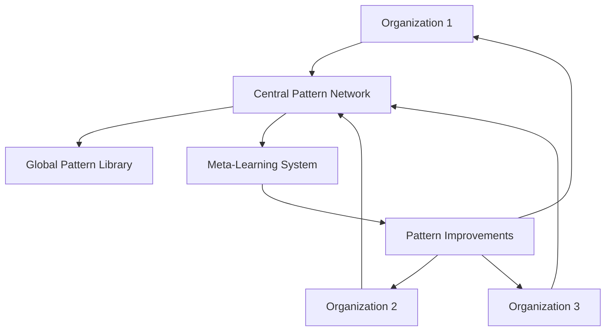

# Section 10: Future Work & Community

## 10.1 Planned Improvements

### 10.1.1 Next Quarter Roadmap (Q1 2025)

**Automated Retrospectives**:

```python
# Goal: AI analyzes its own performance
class AutomatedRetrospective:
    def analyze_sprint(self, sprint_id: str):
        metrics = collect_metrics(sprint_id)
        patterns = identify_patterns(metrics)
        failures = analyze_failures(sprint_id)

        return {
            'success_patterns': extract_success_patterns(patterns),
            'failure_causes': root_cause_analysis(failures),
            'recommended_improvements': generate_improvements(),
            'prompt_adjustments': suggest_prompt_changes()
        }
```

**Predictive Issue Detection**:

```python
# Goal: Predict issues before they occur
class PredictiveAnalyzer:
    def analyze_spec(self, spec: Spec) -> RiskAssessment:
        historical_similar = find_similar_features(spec)
        issue_patterns = extract_issue_patterns(historical_similar)

        return {
            'likely_issues': predict_issues(spec, issue_patterns),
            'risk_score': calculate_risk(spec),
            'mitigation_steps': suggest_mitigations(),
            'additional_agents_needed': recommend_specialists()
        }
```

**Dynamic Workflow Optimization**:

```yaml
# Goal: Adaptive workflow based on task characteristics
dynamic_workflow:
  analyzer:
    inputs:
      - task_complexity
      - risk_profile
      - time_constraints
      - team_capacity

    outputs:
      - optimal_agent_set
      - parallel_opportunities
      - gate_requirements
      - estimated_duration
```

### 10.1.2 Six Month Vision (Q2-Q3 2025)

**Cross-Organization Learning Network**:



**Self-Improving Prompts**:

```python
class SelfImprovingAgent:
    def improve_prompt(self):
        current_performance = measure_performance()
        variations = generate_prompt_variations()

        for variation in variations:
            test_results = test_prompt(variation)
            if test_results.better_than(current_performance):
                self.prompt = variation
                self.version += 1
                log_improvement(test_results)
```

**AI Agent Marketplace**:

```yaml
marketplace:
  specialized_agents:
    - accessibility_specialist: "WCAG compliance expert"
    - performance_optimizer: "Core Web Vitals specialist"
    - localization_expert: "i18n/l10n specialist"
    - blockchain_auditor: "Smart contract specialist"

  pricing_model:
    - per_use: "$5-50 per task"
    - subscription: "$500-2000/month"
    - enterprise: "Custom pricing"
```

### 10.1.3 Long-Term Research (2025-2026)

**Autonomous Process Evolution**:

- Workflow self-modifies based on outcomes
- Agents negotiate optimal handoffs
- Quality gates adjust dynamically
- Pattern library self-curates

**Multi-Modal Development**:

- Voice-to-code workflows
- Diagram-to-implementation
- Video bug reports to fixes
- AR/VR development interfaces

**Quantum-Inspired Parallelization**:

- Superposition of possible implementations
- Parallel universe development branches
- Optimal path selection
- Quantum-inspired optimization

## 10.2 Open Research Questions

### 10.2.1 Fundamental Questions

**1. Optimal Team Size**

```
Current: 11 agents
Questions:
- Is there a magic number?
- Does it vary by domain?
- Can agents self-organize optimal teams?
- What's the cognitive limit for coordination?
```

**2. Context Window Utilization**

```
Current: 200K tokens (Claude)
Future: 1M+ tokens
Questions:
- How does workflow change with unlimited context?
- Optimal context allocation per agent?
- Context compression strategies?
- Shared vs. private context?
```

**3. Quality vs. Speed Trade-off**

```
Current: 14× velocity improvement (Cycle 3→8), 90.9% PR merge rate
Questions:
- Is there an optimal balance?
- Can we achieve both?
- How to dynamically adjust based on needs?
- What's the theoretical limit?
```

### 10.2.2 Technical Questions

**1. Prompt Engineering Science**

```
Questions:
- Can we formalize prompt engineering?
- Mathematical models for prompt optimization?
- Automated prompt generation?
- Universal prompt patterns?
```

**2. Inter-Agent Communication**

```
Questions:
- Optimal communication protocols?
- Lossy vs. lossless information transfer?
- Agent negotiation strategies?
- Conflict resolution mechanisms?
```

**3. Failure Recovery**

```
Questions:
- Automated rollback strategies?
- Checkpoint and restore mechanisms?
- Failure prediction accuracy limits?
- Self-healing workflows?
```

### 10.2.3 Organizational Questions

**1. Human-AI Team Dynamics**

```
Questions:
- How do humans and AI agents best collaborate?
- Trust building mechanisms?
- Responsibility and accountability models?
- Career impact on developers?
```

**2. Economic Models**

```
Questions:
- True cost of quality calculation?
- ROI prediction models?
- Pricing strategies for AI development?
- Value distribution in AI-assisted work?
```

**3. Ethical Considerations**

```
Questions:
- Bias detection and mitigation?
- Transparency requirements?
- Audit trail standards?
- Regulatory compliance automation?
```

## 10.3 Community Contribution Pathways

### 10.3.1 Pattern Contributions

**How to Contribute a Pattern**:

```markdown
## Pattern Submission Process

1. Fork the pattern library repository
2. Create pattern following template
3. Include:
   - Real production usage evidence
   - Test coverage
   - Security validation
   - Performance metrics
4. Submit PR with:
   - Pattern file
   - Test cases
   - Documentation
   - Usage examples
5. Community review (2 weeks)
6. Acceptance criteria:
   - 3+ successful implementations
   - No security issues
   - Performance acceptable
   - Documentation complete
```

**Pattern Categories Needed**:

- Cloud-native patterns
- Microservices patterns
- Event-driven patterns
- Real-time/WebSocket patterns
- Mobile app patterns
- ML/AI integration patterns
- Blockchain patterns
- IoT patterns

### 10.3.2 Agent Contributions

**Create Specialized Agents**:

```yaml
agent_template:
  metadata:
    name: "Agent Name"
    version: "1.0"
    author: "Your Name"
    specialization: "Domain expertise"

  capabilities:
    - capability_1: "Description"
    - capability_2: "Description"

  requirements:
    - tools: ["required_tools"]
    - context: "required_context"
    - dependencies: ["other_agents"]

  prompt: |
    # Full agent prompt here

  validation:
    test_cases: "path/to/tests"
    success_criteria: "criteria.yaml"
```

### 10.3.3 Research Contributions

**Areas Seeking Contributions**:

1. **Benchmark Development**
   - Standard test suites
   - Performance metrics
   - Quality measurements
   - Comparison frameworks

2. **Case Studies**
   - Industry-specific implementations
   - Failure analysis
   - Success stories
   - Lessons learned

3. **Tool Development**
   - Workflow visualization
   - Metric dashboards
   - Pattern analyzers
   - Prompt optimizers

4. **Documentation**
   - Translations
   - Video tutorials
   - Workshop materials
   - Quick start guides

## 10.4 Community Resources

### 10.4.1 Getting Help

**Discord Server**: Community platform coming soon - follow GitHub for announcements

- #getting-started
- #troubleshooting
- #patterns
- #agent-development
- #retrospectives

**GitHub Discussions**: `github.com/ByBren-LLC/WTFB-app/discussions`

- Q&A
- Ideas
- Show and Tell
- Polls

**Office Hours**: Weekly Zoom calls

- Tuesdays 10am PST: Implementation help
- Thursdays 2pm PST: Advanced topics
- First Friday monthly: Retrospective sharing

### 10.4.2 Learning Resources

**Free Resources**:

```yaml
tutorials:
  - getting_started: "30-minute quickstart"
  - first_feature: "Your first multi-agent feature"
  - patterns_101: "Understanding patterns"
  - retrospectives: "Running effective retros"

workshops:
  - monthly_beginner: "First Saturday each month"
  - quarterly_advanced: "Deep dive topics"
  - annual_conference: "SAFe Agents Summit"

documentation:
  - api_reference: "Complete agent API"
  - pattern_library: "500+ patterns"
  - case_studies: "20+ detailed examples"
  - troubleshooting: "Common issues and solutions"
```

**Certification Program** (Planned):

- Level 1: Multi-Agent Practitioner
- Level 2: Workflow Architect
- Level 3: Process Innovation Leader

### 10.4.3 Contributing Back

**Ways to Contribute**:

```markdown
## Contribution Ladder

### Level 1: User

- Use the methodology
- Report issues
- Share feedback

### Level 2: Contributor

- Submit patterns
- Fix documentation
- Answer questions
- Share case studies

### Level 3: Maintainer

- Review PRs
- Triage issues
- Update core agents
- Lead workshops

### Level 4: Core Team

- Set direction
- Design new features
- Research innovations
- Community leadership
```

## 10.5 Research Collaboration

### 10.5.1 Academic Partnerships

**Current Collaborations**:

- Stanford AI Lab: Prompt optimization research
- MIT CSAIL: Multi-agent coordination
- CMU: Software engineering metrics
- University of Toronto: AI safety

**Research Topics**:

- Formal verification of agent workflows
- Optimal team composition algorithms
- Quality prediction models
- Failure recovery strategies

### 10.5.2 Industry Partnerships

**Pilot Programs**:

```yaml
pilot_partnership:
  duration: 3_months
  commitment:
    - Share anonymized metrics
    - Participate in monthly review
    - Contribute patterns back
    - Case study publication

  benefits:
    - Direct support
    - Custom agent development
    - Priority feature requests
    - Conference speaking opportunities
```

### 10.5.3 Open Research Initiatives

**Multi-Agent Development Benchmark**:

```python
# Standardized benchmark for comparing approaches
class MultiAgentBenchmark:
    tasks = [
        'simple_crud_api',
        'complex_business_logic',
        'ui_with_interactions',
        'database_migration',
        'security_vulnerability_fix',
        'performance_optimization'
    ]

    metrics = [
        'time_to_complete',
        'defect_rate',
        'documentation_coverage',
        'test_coverage',
        'security_score',
        'maintainability_index'
    ]

    def run_benchmark(self, workflow_implementation):
        results = {}
        for task in self.tasks:
            results[task] = workflow_implementation.execute(task)
        return calculate_scores(results)
```

## 10.6 Long-Term Vision

### 10.6.1 Five-Year Outlook

**2025-2029 Evolution**:

```
2025: Adoption Phase
- 1,000+ organizations using
- 10,000+ patterns in library
- Academic research programs

2026: Maturation Phase
- Industry standards emerging
- Certification programs
- Enterprise tooling

2027: Innovation Phase
- Self-evolving workflows
- Cross-organization learning
- AI agent ecosystems

2028: Transformation Phase
- Development paradigm shift
- Human-AI parity in many tasks
- New job roles emerging

2029: New Normal
- Multi-agent as default
- Single-agent considered legacy
- Fully autonomous subsystems
```

### 10.6.2 Impact on Software Development

**Predicted Changes**:

- **Role Evolution**: Developers become orchestrators
- **Quality Standards**: 10x improvement becomes expected
- **Development Speed**: Complex features in hours, not weeks
- **Documentation**: 100% coverage becomes standard
- **Testing**: Automated test generation and validation
- **Security**: Built-in by default, verified continuously
- **Maintenance**: Self-healing and self-updating systems

### 10.6.3 Societal Impact

**Positive Potential**:

- Democratized software creation
- Reduced software defects globally
- Accelerated innovation
- Improved accessibility
- Lower development costs

**Risks to Mitigate**:

- Job displacement concerns
- Over-reliance on AI
- Loss of fundamental skills
- Centralization of control
- Bias amplification

## 10.7 Call to Action

### Join the Movement

This methodology is not ours alone - it belongs to the community. We invite you to:

1. **Try It**: Implement for one feature
2. **Measure It**: Share your metrics
3. **Improve It**: Contribute patterns and agents
4. **Teach It**: Help others learn
5. **Research It**: Explore open questions
6. **Shape It**: Influence future direction

### Get Started Today

```bash
# Clone the repository
git clone https://github.com/ByBren-LLC/WTFB-app

# Join the community
# Discord: Coming Soon - follow GitHub for announcements
# GitHub: github.com/ByBren-LLC/WTFB-app

# Start your first multi-agent feature
./scripts/quick-start.sh
```

The future of software development is multi-agent, collaborative, and quality-focused. Join us in building it.

---

_Next: Section 11 provides conclusions and final thoughts._
