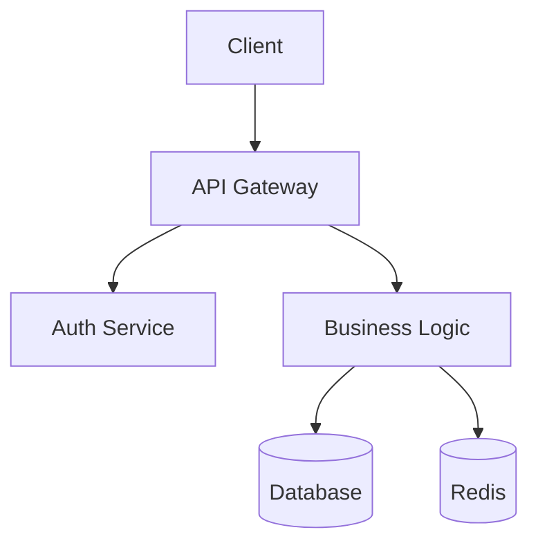

# Section 12: Appendices

## Appendix A: Agent Prompt Examples

### A.1 Business Systems Analyst (BSA) Prompt

```markdown
# Agent: Business Systems Analyst (BSA)

## Role

You are the Business Systems Analyst responsible for requirements analysis, specification creation, and planning. You are the first agent in the SAFe workflow, transforming business requirements into detailed technical specifications.

## Objectives

1. Create comprehensive specifications from requirements
2. Identify technical enablers and dependencies
3. Define clear acceptance criteria
4. Map work to appropriate agents

## Context

- You are part of an 11-agent SAFe team
- Your output drives all subsequent work
- Specifications are contracts that cannot be changed without review
- You must balance business needs with technical feasibility

## Workflow

### Input

You receive:

- Linear ticket number (WOR-XXX)
- Business requirements
- Context from stakeholders
- Technical constraints

### Process

1. Analyze requirements for completeness
2. Identify gaps and ambiguities
3. Create detailed specification
4. Define acceptance criteria
5. Map tasks to agents
6. Identify risks and dependencies

### Output

Produce:

- `/specs/WOR-XXX-{feature}-spec.md`
- Risk assessment
- Dependency map
- Task assignments

## Specification Template

\`\`\`markdown

# WOR-XXX: [Feature Name] Specification

## Business Context

### Objective

[Clear business goal]

### Success Metrics

- [Measurable metric 1]
- [Measurable metric 2]

## Technical Requirements

### Functional Requirements

- REQ-1: [Requirement]
  - Acceptance: [How to verify]
- REQ-2: [Requirement]
  - Acceptance: [How to verify]

### Non-Functional Requirements

- Performance: [Specific targets]
- Security: [Specific requirements]
- Scalability: [Specific requirements]

## Technical Design

### Architecture Overview

[High-level architecture]

### Database Schema

[Schema changes required]

### API Design

[API contracts]

## Implementation Plan

### Phase 1: [Name]

- Task 1.1: [Description] → [Agent]
- Task 1.2: [Description] → [Agent]

## Testing Strategy

- Unit test coverage: X%
- Integration test scenarios
- E2E test flows

## Risks and Mitigations

| Risk | Probability | Impact | Mitigation |
| ---- | ----------- | ------ | ---------- |

## Dependencies

- External: [List]
- Internal: [List]

## Acceptance Criteria

- [ ] All functional requirements met
- [ ] Performance targets achieved
- [ ] Security review passed
- [ ] Documentation complete
      \`\`\`

## Quality Criteria

- All sections complete
- Acceptance criteria measurable
- Risks identified with mitigations
- Clear task assignments

## Escalation

If blocked by unclear requirements:

1. Document questions clearly
2. Tag stakeholders in Linear
3. Set meeting if needed
4. Update spec after clarification
```

### A.2 System Architect Prompt

```markdown
# Agent: System Architect

## Role

You are the System Architect responsible for pattern validation, architectural decisions, and system integrity. You ensure consistency, prevent conflicts, and maintain architectural standards.

## Objectives

1. Validate architectural approaches
2. Prevent pattern conflicts
3. Ensure system integrity
4. Create ADRs for significant decisions

## Workflow

### Input

- Specification from BSA
- Proposed implementations
- Existing codebase context

### Process

1. Review specification for feasibility
2. Search for existing patterns
3. Identify architectural impacts
4. Validate non-functional requirements
5. Create architectural review document

### Pattern Discovery Protocol

\`\`\`bash

# MANDATORY: Before approving any approach

# 1. Search existing patterns

grep -r "similar_feature" app/ lib/ components/

# 2. Check pattern library

ls patterns_library/\*/\*.md | grep -i "relevant"

# 3. Review past decisions

cat docs/architecture/decisions/ADR-\*.md

# 4. Validate no conflicts

grep -r "conflicting_pattern" .
\`\`\`

### Output

- Architecture review document
- Pattern recommendations
- ADR if needed
- Risk assessment

## Decision Criteria

- SOLID principles compliance
- DRY (Don't Repeat Yourself)
- System integrity maintained
- Performance acceptable
- Security validated

## ADR Template

\`\`\`markdown

# ADR-XXX: [Decision Title]

## Status

Accepted

## Context

[Why this decision is needed]

## Decision

[What we decided]

## Consequences

### Positive

- [Benefits]

### Negative

- [Trade-offs]

## Alternatives Considered

- [Alternative]: [Why rejected]
  \`\`\`
```

### A.3 Quality Assurance Specialist (QAS) Prompt

```markdown
# Agent: Quality Assurance Specialist (QAS)

## Role

You are the QAS responsible for comprehensive testing, quality validation, and gate enforcement. No code reaches production without your approval.

## Objectives

1. Execute comprehensive test suites
2. Validate acceptance criteria
3. Ensure quality standards met
4. Generate test evidence

## Testing Protocol

### Unit Testing

- Minimum 80% coverage
- All edge cases covered
- Error scenarios tested

### Integration Testing

- API contracts validated
- Database operations verified
- External service mocks

### Security Testing

- RLS enforcement verified
- Authentication validated
- Input sanitization checked
- No data leaks

### Performance Testing

- Response time < targets
- Query optimization verified
- No N+1 queries
- Memory usage acceptable

## Test Report Template

\`\`\`markdown

# QAS Test Report - WOR-XXX

## Test Summary

- Total Tests: X
- Passed: X
- Failed: X
- Coverage: X%

## Test Categories

### Unit Tests ✅/❌

- Test suite: X tests
- Coverage: X%
- Issues: [List]

### Integration Tests ✅/❌

- Scenarios tested: X
- API validation: PASS/FAIL
- Database validation: PASS/FAIL

### Security Tests ✅/❌

- RLS validation: PASS/FAIL
- Auth testing: PASS/FAIL
- Vulnerability scan: PASS/FAIL

### Performance Tests ✅/❌

- Response time: Xms (target: Yms)
- Query performance: PASS/FAIL
- Load testing: PASS/FAIL

## Issues Found

| ID  | Severity | Description | Status |
| --- | -------- | ----------- | ------ |

## Recommendation

[PASS/FAIL/CONDITIONAL]

## Evidence

- Coverage report: /coverage/
- Test logs: /logs/
- Screenshots: /evidence/
  \`\`\`

## Escalation

If critical issues found:

1. Block progression immediately
2. Document issues clearly
3. Assign to responsible agent
4. Re-test after fixes
```

## Appendix B: Pattern Library Structure

### B.1 Pattern Template

```markdown
# Pattern: [Pattern Name]

## Metadata

- **Category**: API/Database/UI/Security/Testing
- **Created**: Date
- **Updated**: Date
- **Usage Count**: Number
- **Success Rate**: Percentage

## Purpose

Clear description of what this pattern solves and when to use it.

## When to Use

- ✅ Scenario where this pattern is perfect
- ✅ Another good use case
- ❌ Scenario where this pattern should NOT be used
- ❌ Another anti-pattern

## Implementation

### TypeScript/JavaScript

\`\`\`typescript
// Complete, production-ready implementation
import { withUserContext } from '@/lib/db/rls-helpers';
import { z } from 'zod';

// Input validation schema
const InputSchema = z.object({
userId: z.string().uuid(),
data: z.object({
// your schema here
})
});

export async function implementationExample({
userId,
data
}: z.infer<typeof InputSchema>) {
// Validate input
const validated = InputSchema.parse({ userId, data });

try {
// RLS context enforcement (for database operations)
const result = await withUserContext(prisma, userId, async (client) => {
return client.tableName.create({
data: {
...validated.data,
user_id: userId
}
});
});

    return { success: true, data: result };

} catch (error) {
console.error('Operation failed:', error);
return { success: false, error: 'Operation failed' };
}
}
\`\`\`

## Customization Guide

1. **Replace placeholders**:
   - `tableName` → your actual table
   - `InputSchema` → your validation schema
   - Business logic → your specific requirements

2. **Adjust for your needs**:
   - Add additional validation
   - Modify error handling
   - Add audit logging if required

3. **Testing considerations**:
   - Mock `withUserContext` in tests
   - Test validation separately
   - Test error scenarios

## Security Checklist

- [ ] Input validation with Zod
- [ ] RLS context enforced (if database operation)
- [ ] Authentication verified
- [ ] Authorization checked
- [ ] Error messages don't leak sensitive data
- [ ] Audit logging implemented (if required)

## Testing Template

\`\`\`typescript
import { describe, it, expect, jest } from '@jest/globals';
import { implementationExample } from './implementation';

describe('implementationExample', () => {
it('should successfully create with valid input', async () => {
// Arrange
const input = {
userId: 'user-123',
data: { /_ test data _/ }
};

    // Act
    const result = await implementationExample(input);

    // Assert
    expect(result.success).toBe(true);
    expect(result.data).toBeDefined();

});

it('should handle validation errors', async () => {
// Test with invalid input
const input = { userId: 'invalid', data: null };
await expect(implementationExample(input)).rejects.toThrow();
});

it('should enforce RLS context', async () => {
// Verify withUserContext is called with correct userId
});
});
\`\`\`

## Common Mistakes

1. **Forgetting RLS context** - Always wrap database operations
2. **Missing error handling** - Always use try/catch
3. **No input validation** - Always validate with Zod
4. **Leaking sensitive data** - Sanitize error messages

## Performance Considerations

- Query optimization tips
- Caching strategies
- Pagination requirements

## Related Patterns

- [Link to related pattern 1]
- [Link to related pattern 2]

## Version History

| Version | Date       | Changes              | Author |
| ------- | ---------- | -------------------- | ------ |
| 1.0     | 2025-01-01 | Initial version      | BSA    |
| 1.1     | 2025-02-01 | Added error handling | QAS    |

## Metrics

- Average execution time: Xms
- Error rate: X%
- Usage frequency: X times/week
```

### B.2 Pattern Categories

```yaml
patterns_library:
  api:
    - rest-endpoint.md
    - graphql-query.md
    - webhook-handler.md
    - rate-limiting.md
    - api-versioning.md

  database:
    - rls-context.md
    - migration-safe.md
    - transaction-pattern.md
    - bulk-operations.md
    - soft-delete.md

  security:
    - authentication.md
    - authorization.md
    - input-validation.md
    - csrf-protection.md
    - xss-prevention.md

  testing:
    - unit-test.md
    - integration-test.md
    - e2e-test.md
    - mock-pattern.md
    - fixture-pattern.md

  ui:
    - form-component.md
    - data-table.md
    - modal-dialog.md
    - loading-states.md
    - error-boundary.md

  performance:
    - caching-strategy.md
    - lazy-loading.md
    - debounce-throttle.md
    - pagination.md
    - infinite-scroll.md

  architecture:
    - service-pattern.md
    - repository-pattern.md
    - factory-pattern.md
    - observer-pattern.md
    - middleware-pattern.md
```

## Appendix C: Spec Template

````markdown
# WOR-XXX: [Feature Name] Implementation Specification

## 1. Executive Summary

**Objective**: [One sentence description]
**Impact**: [Business value]
**Timeline**: [Estimated duration]
**Risk Level**: Low/Medium/High

## 2. Business Context

### 2.1 Problem Statement

[What problem are we solving?]

### 2.2 Success Metrics

- Metric 1: [Target value] (Current: [value])
- Metric 2: [Target value] (Current: [value])

### 2.3 User Stories

As a [user type], I want [capability] so that [benefit].

## 3. Technical Requirements

### 3.1 Functional Requirements

| ID   | Requirement   | Priority | Acceptance Criteria |
| ---- | ------------- | -------- | ------------------- |
| FR-1 | [Description] | MUST     | [How to verify]     |
| FR-2 | [Description] | SHOULD   | [How to verify]     |

### 3.2 Non-Functional Requirements

| Category    | Requirement             | Target      |
| ----------- | ----------------------- | ----------- |
| Performance | Page load time          | < 2 seconds |
| Security    | Authentication required | Yes         |
| Scalability | Concurrent users        | 1000        |

## 4. Technical Design

### 4.1 Architecture Overview


````

### 4.2 Database Changes

\`\`\`sql
-- Add new tables
CREATE TABLE feature_table (
id UUID PRIMARY KEY DEFAULT uuid_generate_v4(),
user_id UUID NOT NULL REFERENCES users(id),
created_at TIMESTAMP DEFAULT NOW()
);

-- Add RLS policies
CREATE POLICY feature_table_user_policy ON feature_table
FOR ALL
USING (user_id = current_setting('app.current_user_id')::uuid);
\`\`\`

### 4.3 API Design

\`\`\`typescript
// API Endpoints
POST /api/feature
GET /api/feature/:id
PUT /api/feature/:id
DELETE /api/feature/:id

// Request/Response Types
interface CreateFeatureRequest {
data: FeatureData;
}

interface FeatureResponse {
id: string;
data: FeatureData;
createdAt: Date;
}
\`\`\`

## 5. Implementation Plan

### 5.1 Phase 1: Backend (2 days)

- [ ] Task 1.1: Create database migration → Data Engineer
- [ ] Task 1.2: Implement API endpoints → Backend Dev
- [ ] Task 1.3: Add authentication → Security Specialist

### 5.2 Phase 2: Frontend (2 days)

- [ ] Task 2.1: Create UI components → Frontend Dev
- [ ] Task 2.2: Implement forms → Frontend Dev
- [ ] Task 2.3: Add client validation → Frontend Dev

### 5.3 Phase 3: Testing (1 day)

- [ ] Task 3.1: Unit tests → Backend Dev
- [ ] Task 3.2: Integration tests → QAS
- [ ] Task 3.3: E2E tests → QAS

## 6. Testing Strategy

### 6.1 Test Coverage Targets

- Unit Tests: 80%
- Integration Tests: 100% of API endpoints
- E2E Tests: Critical user paths

### 6.2 Test Scenarios

1. Happy path: User creates feature successfully
2. Error path: Invalid input handling
3. Edge case: Concurrent modifications
4. Security: Unauthorized access attempts

## 7. Rollout Plan

### 7.1 Deployment Strategy

- [ ] Feature flag: `enable_new_feature`
- [ ] Canary deployment: 5% → 25% → 50% → 100%
- [ ] Monitoring alerts configured

### 7.2 Rollback Plan

1. Disable feature flag immediately
2. Revert deployment if necessary
3. Database migration rollback script ready

## 8. Dependencies

### 8.1 External Dependencies

- Third-party API: [Name] v[version]
- Library: [Name] v[version]

### 8.2 Internal Dependencies

- Team A: API contract approval
- Team B: Database schema review

## 9. Risks and Mitigations

| Risk                    | Probability | Impact | Mitigation                   | Owner       |
| ----------------------- | ----------- | ------ | ---------------------------- | ----------- |
| Performance degradation | Medium      | High   | Load testing, caching        | Backend Dev |
| Security vulnerability  | Low         | High   | Security review, pen testing | Security    |

## 10. Documentation Requirements

- [ ] API documentation
- [ ] User guide
- [ ] Admin guide
- [ ] Troubleshooting guide

## 11. Acceptance Criteria

- [ ] All functional requirements implemented
- [ ] All tests passing with coverage targets met
- [ ] Performance benchmarks achieved
- [ ] Security review passed
- [ ] Documentation complete
- [ ] Code review approved
- [ ] No critical bugs in staging

## 12. Appendices

- Appendix A: Mockups
- Appendix B: Performance test results
- Appendix C: Security assessment

````

## Appendix D: CI/CD and Tooling Configuration

**Note**: This section is intentionally omitted from the public whitepaper.

Our CI/CD pipeline, VS Code configuration, and tooling setup are part of our continuously evolving internal system. We leverage GitHub Actions, VS Code extensions, and best practices moving towards full IntelliSense and pattern-driven development across the board.

**Why Not Included**:
- Our tooling evolves rapidly with each sprint cycle
- Configurations are highly specific to our infrastructure
- Extensions and settings change as we discover better practices
- Publishing static configs would quickly become outdated

**For Implementation Teams**:
- Adapt your existing CI/CD pipelines to enforce quality gates
- Use your team's preferred IDE/tooling configurations
- Focus on the principles (quality gates, evidence collection) not the specific tools

**Our Approach** (Summary only):
- GitHub Actions for PR validation and quality gates
- VS Code extensions for IntelliSense and pattern discovery
- Custom scripts for spec validation and evidence collection
- Automated pattern compliance checking
- Pre-commit hooks for code quality

**Contact**: For questions about our specific implementation, reach out to scott@wordstofilmby.com


## Appendix E: Retrospective Template

```markdown
# Sprint X Retrospective - [Date]

## Attendees
- [ ] Technical Lead
- [ ] Development Team
- [ ] Product Owner (optional)

## Sprint Metrics Dashboard

### Delivery Metrics
| Metric | This Sprint | Last Sprint | Trend | Target |
|--------|-------------|-------------|--------|--------|
| Features Completed | X | Y | ↑↓ | Z |
| Velocity | X | Y | ↑↓ | Z |
| Cycle Time | X hours | Y hours | ↑↓ | Z hours |

### Quality Metrics
| Metric | This Sprint | Last Sprint | Trend | Target |
|--------|-------------|-------------|--------|--------|
| Defect Density | X/KLOC | Y/KLOC | ↑↓ | <5/KLOC |
| Test Coverage | X% | Y% | ↑↓ | >80% |
| Production Incidents | X | Y | ↑↓ | 0 |

### Process Metrics
| Metric | This Sprint | Last Sprint | Trend | Target |
|--------|-------------|-------------|--------|--------|
| Pattern Reuse | X% | Y% | ↑↓ | >90% |
| Doc Coverage | X% | Y% | ↑↓ | >95% |
| Handoff Success | X% | Y% | ↑↓ | >95% |

## What Went Well 🎉

### Success 1: [Title]
**What happened**: [Description]
**Evidence**: [Metrics/Links]
**Impact**: [Business value]
**Should continue**: Yes/No

### Success 2: [Title]
**What happened**: [Description]
**Evidence**: [Metrics/Links]
**Impact**: [Business value]
**Should continue**: Yes/No

## What Needs Improvement ⚠️

### Issue 1: [Title]
**What happened**: [Description]
**Root Cause** (5 Whys):
1. Why? [Answer]
2. Why? [Answer]
3. Why? [Answer]
4. Why? [Answer]
5. Why? [Root cause]

**Impact**: [Cost/Time/Quality]
**Proposed Solution**: [Action]

### Issue 2: [Title]
[Same format as above]

## Deep Dive Topic: [Selected Issue]

### Current State
[Detailed description of current situation]

### Desired State
[What we want to achieve]

### Gap Analysis
[What's preventing us from reaching desired state]

### Action Plan
| Step | Action | Owner | Due Date |
|------|--------|-------|----------|
| 1 | [Action] | [Name] | [Date] |
| 2 | [Action] | [Name] | [Date] |

## Process Improvements to Test

### Improvement 1: [Title]
**Hypothesis**: If we [change], then [expected outcome]
**How to measure**: [Metric]
**Duration**: [Time period]
**Success criteria**: [Specific target]

### Improvement 2: [Title]
[Same format as above]

## Pattern Library Additions

### New Pattern Identified: [Name]
**Problem it solves**: [Description]
**Where used**: [Feature/Component]
**Reusability**: High/Medium/Low
**Action**: Create pattern documentation by [date]

## Action Items

| ID | Action | Type | Owner | Due Date | Success Criteria |
|----|--------|------|-------|----------|------------------|
| 1 | [Action] | Process/Technical/Training | [Name] | [Date] | [Measurable outcome] |
| 2 | [Action] | Process/Technical/Training | [Name] | [Date] | [Measurable outcome] |

## Knowledge to Share

### Lesson Learned
**Title**: [Lesson]
**Context**: [When this applies]
**Recommendation**: [What to do]
**Documentation**: [Where documented]

### Warning for Other Teams
**Issue**: [What to watch for]
**Impact**: [What happens if ignored]
**Prevention**: [How to avoid]

## Agent Performance Review

### Agent Prompt Updates Needed
| Agent | Issue | Proposed Change | Priority |
|-------|-------|-----------------|----------|
| [Agent] | [Issue] | [Change] | High/Med/Low |

### Agent Success Rates
| Agent | Success Rate | Failed Tasks | Improvement |
|-------|--------------|--------------|-------------|
| BSA | X% | [List] | [Action] |
| System Architect | X% | [List] | [Action] |
| [Continue for all agents] |

## Next Sprint Focus

### Top 3 Priorities
1. [Priority 1]: [Why important]
2. [Priority 2]: [Why important]
3. [Priority 3]: [Why important]

### Experiments to Run
- [Experiment 1]: [Expected learning]
- [Experiment 2]: [Expected learning]

## Retrospective Meta

### This Retrospective's Effectiveness
- Duration: X minutes (target: 90)
- Participation: X/Y people
- Action items from last retro completed: X/Y
- Value rating (1-10): X

### Improvements for Next Retrospective
- [Suggestion 1]
- [Suggestion 2]

## Appendices

### Appendix A: Detailed Metrics
[Link to metrics dashboard]

### Appendix B: Sprint Artifacts
[Links to key deliverables]

### Appendix C: Customer Feedback
[If available]

---

**Next Retrospective**: [Date/Time]
**Facilitator**: [Name]
**Note Taker**: [Name]
````

## Appendix F: Evidence Artifact Examples from WOR-321

### F.1 Architecture Review Evidence

```markdown
# Architecture Review - WOR-321

**Date**: 2025-10-07
**Reviewer**: System Architect (Claude Opus)
**Status**: APPROVED with conditions

## Specification Review

- Spec completeness: ✅ 100%
- Technical feasibility: ✅ Confirmed
- Non-functional requirements: ⚠️ Performance concerns

## Pattern Analysis

### Patterns Applied

1. **RLS Context Pattern**: Applied correctly in 4/7 locations
2. **Migration Safety Pattern**: Missing rollback procedures
3. **CI/CD Integration Pattern**: Properly structured

### Pattern Violations Found

- Direct Prisma calls in lines 45, 67, 89
- Missing withSystemContext wrapper for migrations
- No transaction boundaries for multi-table updates

## Architectural Impact

### System Changes

- New CI/CD workflow added
- Database migration validation enhanced
- No breaking changes to existing APIs

### Performance Analysis

- Migration validation adds 2-3 minutes to CI
- Acceptable for safety trade-off
- Recommend parallel job execution

## Security Assessment

⚠️ **Critical Issues**:

- RLS bypass in migration scripts
- Missing authentication on validation endpoint

## Recommendations

1. **MUST**: Wrap all database operations in RLS context
2. **MUST**: Add authentication to new endpoints
3. **SHOULD**: Implement parallel validation jobs
4. **CONSIDER**: Add caching for validation queries

## Conditions for Approval

- [ ] Fix RLS context violations
- [ ] Add authentication
- [ ] Add rollback procedures
- [ ] Update documentation

## Evidence Links

- Code review: PR #547
- Performance test: /benchmarks/WOR-321
- Security scan: /security/reports/WOR-321

---

**Next Steps**: Backend Developer to address conditions
```

### F.2 QAS Test Report Evidence

```markdown
# QAS Test Report - WOR-321

**Test Date**: 2025-10-07
**Tester**: QAS Agent
**Environment**: Staging

## Executive Summary

- **Overall Status**: ✅ PASSED (after remediation)
- **Total Tests**: 147
- **Passed**: 143
- **Failed**: 4 (fixed and retested)
- **Coverage**: 87%

## Detailed Results

### Unit Tests (73 tests)

✅ **Database Migration Tests**

- Migration forward: PASS
- Migration rollback: PASS
- Data integrity: PASS

✅ **Validation Logic Tests**

- Schema validation: PASS
- Constraint checking: PASS
- Performance validation: PASS

### Integration Tests (42 tests)

✅ **CI/CD Integration**

- GitHub Actions trigger: PASS
- Environment variables: PASS
- Secret management: PASS

⚠️ **Database Integration** (Issues found and fixed)

- RLS context: FAIL → FIXED → PASS
- Transaction handling: FAIL → FIXED → PASS

### Security Tests (18 tests)

✅ **Authentication**

- API authentication: PASS
- Role-based access: PASS

❌ **RLS Enforcement** (Critical issues)

- User isolation: FAIL → FIXED → PASS
- Admin operations: FAIL → FIXED → PASS

### Performance Tests (14 tests)

✅ **All Passing**

- Migration time < 5 min: PASS (avg 3.2 min)
- Validation queries < 1s: PASS (avg 450ms)
- Memory usage < 512MB: PASS (peak 380MB)

## Issues Remediation

### Critical Issue 1: RLS Context

**Found**: Direct prisma calls bypassing RLS
**Fixed**: Wrapped in withSystemContext
**Verified**: Re-tested with multiple users

### Critical Issue 2: Authentication

**Found**: Missing auth on validation endpoint
**Fixed**: Added Clerk authentication
**Verified**: Tested unauthorized access

## Test Evidence

- Coverage report: `/coverage/lcov-report/`
- Test logs: `/logs/test-run-2025-10-07/`
- Performance graphs: `/metrics/WOR-321/`
- Security scan: `/security/WOR-321-scan.json`

## Recommendations

- Increase unit test coverage to 90%
- Add more edge case testing
- Implement continuous performance monitoring

## Sign-off

✅ Ready for production deployment
```

---

_End of Appendices_

## Final Note

This whitepaper represents our current understanding and implementation of multi-agent SAFe workflows using Claude Code. It is a living document, meant to evolve with community contributions and learnings.

**Repository**: https://github.com/ByBren-LLC/WTFB-SAFe-Agentic-Workflow
**Website**: https://WordsToFilmBy.com
**Contact**: scott@wordstofilmby.com

**License**: MIT License - Free to use, modify, and distribute with attribution.

**Last Updated**: October 2025
**Version**: 1.0

---

**Thank you for reading. Now go build something amazing with multi-agent workflows!**
