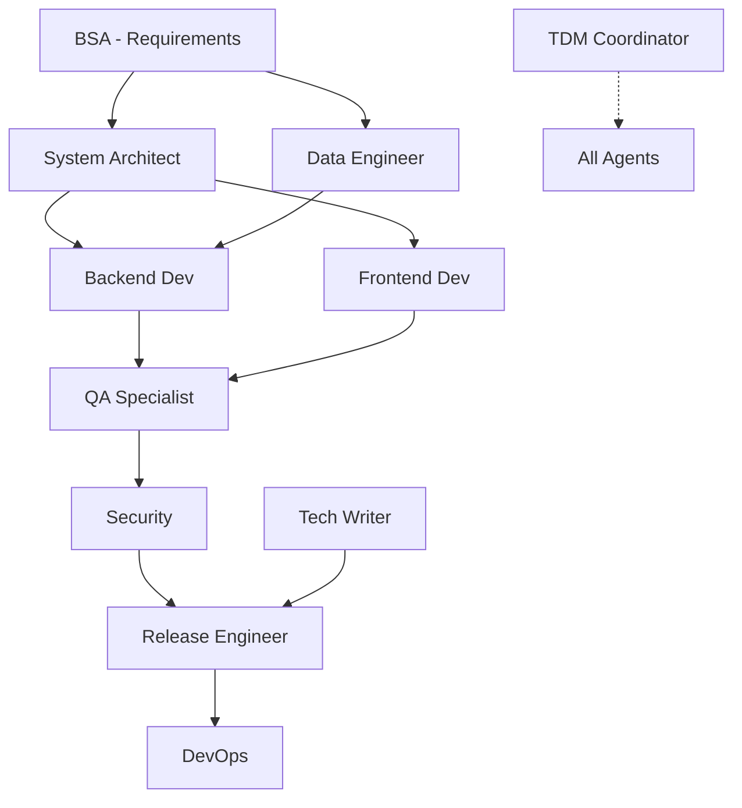

# Section 5: Architecture & Implementation

## 5.1 The 11-Agent SAFe ART Architecture

### 5.1.1 Complete Agent Roster

| Agent                                  | Role                                        | Primary Tools     | Success Criteria                       | Handoff Outputs                  |
| -------------------------------------- | ------------------------------------------- | ----------------- | -------------------------------------- | -------------------------------- |
| **Business Systems Analyst (BSA)**     | Requirements analysis, spec creation        | Read, Write       | Complete spec with acceptance criteria | `/specs/WOR-XXX-spec.md`         |
| **System Architect**                   | Pattern validation, architectural decisions | Read, Grep, Write | No conflicts, patterns approved        | Architecture review doc          |
| **Data Engineer**                      | Database design, migrations, RLS            | Read, Write, Bash | Schema valid, RLS enforced             | Migration files, SQL scripts     |
| **Backend Developer**                  | API implementation, business logic          | All tools         | Tests pass, API functional             | Source files, tests              |
| **Frontend Developer**                 | UI implementation, user experience          | All tools         | Components render, responsive          | React components, styles         |
| **Quality Assurance Specialist (QAS)** | Testing, validation, quality gates          | Read, Bash, Grep  | 100% test pass, coverage met           | Test report, validation evidence |
| **Release Train Engineer (RTE)**       | Deployment, PR creation, coordination       | All tools         | PR ready, CI passing                   | Pull request, deployment docs    |
| **DevOps Engineer**                    | Infrastructure, CI/CD, monitoring           | All tools         | Pipeline functional, monitoring active | Config files, workflows          |
| **Security Specialist**                | Security review, threat analysis            | Read, Grep        | No vulnerabilities, RLS verified       | Security audit report            |
| **Technical Writer**                   | Documentation, guides, changelog            | Read, Write       | Docs complete, accurate                | User guides, API docs            |
| **Technical Debt Manager (TDM)**       | Coordination, prioritization, escalation    | Read, Linear MCP  | Work assigned, blockers resolved       | Status updates, assignments      |

### 5.1.2 Agent Interaction Matrix



### 5.1.3 Success Criteria Enforcement

Each agent has mandatory success validation:

```typescript
interface AgentSuccess {
  agent: string;
  criteria: {
    mandatory: string[]; // Must pass to proceed
    optional: string[]; // Should achieve
    metrics: {
      // Quantified measures
      [key: string]: {
        target: number;
        actual: number;
        pass: boolean;
      };
    };
  };
  evidence: string[]; // Artifact paths
  validation: "PASS" | "FAIL" | "PARTIAL";
}
```

Real example from WOR-321:

```json
{
  "agent": "QAS",
  "criteria": {
    "mandatory": [
      "All unit tests pass",
      "Integration tests pass",
      "RLS validation complete"
    ],
    "metrics": {
      "test_coverage": {
        "target": 80,
        "actual": 87,
        "pass": true
      },
      "performance": {
        "target": 1000, // ms
        "actual": 750,
        "pass": true
      }
    }
  },
  "evidence": [
    "/docs/testing/WOR-321-QAS-Test-Report.md",
    "/coverage/lcov-report/index.html"
  ],
  "validation": "PASS"
}
```

## 5.2 Pattern-Driven Development

### 5.2.1 Mandatory Pattern Discovery Protocol

Before implementation, agents MUST search for existing patterns:

```bash
# Step 1: Search codebase for similar implementations
grep -r "similar_feature" app/ lib/ components/

# Step 2: Check pattern library
ls patterns_library/category/*.md

# Step 3: Review past implementations
grep -r "pattern_name" specs/WOR-*.md

# Step 4: Validate with System Architect
# If no pattern exists, System Architect creates one
```

### 5.2.2 Pattern Library Structure

```
patterns_library/
├── README.md                 # Pattern index and guidelines
├── api/
│   ├── rest-endpoint.md     # REST API pattern
│   ├── graphql-query.md     # GraphQL pattern
│   └── webhook-handler.md   # Webhook pattern
├── database/
│   ├── rls-context.md       # RLS enforcement pattern
│   ├── migration-safe.md    # Safe migration pattern
│   └── transaction.md       # Transaction pattern
├── security/
│   ├── authentication.md    # Auth pattern
│   ├── authorization.md     # Authz pattern
│   └── input-validation.md  # Validation pattern
├── testing/
│   ├── unit-test.md        # Unit test pattern
│   ├── integration.md      # Integration pattern
│   └── e2e-test.md        # E2E test pattern
└── ui/
    ├── form-component.md   # Form pattern
    ├── data-table.md      # Table pattern
    └── modal-dialog.md    # Modal pattern
```

### 5.2.3 Pattern Template

Every pattern follows this structure:

```markdown
# Pattern: [Name]

## Purpose

Clear description of what this pattern solves

## When to Use

- Scenario 1
- Scenario 2
- Scenario 3

## Implementation

\`\`\`typescript
// Complete, copy-paste ready code
// With placeholders clearly marked
export async function {functionName}({params}: {ParamType}) {
// RLS context enforcement (if database operation)
const result = await withUserContext(prisma, userId, async (client) => {
return client.{table}.{operation}({
where: { user_id: userId }
});
});

return result;
}
\`\`\`

## Customization Guide

1. Replace `{functionName}` with your function name
2. Update `{ParamType}` with your parameters
3. Modify business logic as needed

## Security Checklist

- [ ] Input validation with Zod
- [ ] Authentication required
- [ ] RLS context enforced
- [ ] Error handling comprehensive
- [ ] Audit logging implemented

## Testing Template

\`\`\`typescript
describe('{functionName}', () => {
it('should {expected behavior}', async () => {
// Test implementation
});
});
\`\`\`

## Common Mistakes

- Forgetting RLS context
- Missing error handling
- No input validation

## Related Patterns

- [Other Pattern 1]
- [Other Pattern 2]
```

### 5.2.4 Pattern Governance

**Pattern Creation**: Only System Architect can approve new patterns

**Pattern Updates**: Require architecture review and migration plan

**Pattern Deprecation**: 2-sprint warning before removal

**Pattern Metrics**: Track usage and defect correlation

## 5.3 Spec-Driven Workflow

### 5.3.1 The Specification as Contract

Every feature begins with a BSA-created specification:

```markdown
# WOR-XXX: [Feature Name] Implementation Specification

## 1. Business Context

### Objective

[Clear business goal]

### Success Metrics

- Metric 1: [Target value]
- Metric 2: [Target value]

## 2. Technical Requirements

### Functional Requirements

- REQ-1: [Requirement with acceptance criteria]
- REQ-2: [Requirement with acceptance criteria]

### Non-Functional Requirements

- Performance: [Specific targets]
- Security: [Specific requirements]
- Scalability: [Specific requirements]

## 3. Technical Design

### Architecture

[Diagram or description of architecture]

### Database Changes

\`\`\`sql
-- Schema changes with RLS policies
\`\`\`

### API Design

\`\`\`typescript
// API interface definitions
\`\`\`

## 4. Implementation Plan

### Phase 1: [Description]

- Task 1.1: [Assigned to: Agent]
- Task 1.2: [Assigned to: Agent]

### Phase 2: [Description]

- Task 2.1: [Assigned to: Agent]
- Task 2.2: [Assigned to: Agent]

## 5. Testing Strategy

### Unit Tests

- Coverage target: X%
- Key test cases: [List]

### Integration Tests

- Scenarios: [List]

### E2E Tests

- User flows: [List]

## 6. Rollout Plan

### Deployment Strategy

- [ ] Feature flag
- [ ] Canary deployment
- [ ] Blue-green deployment

### Rollback Plan

[Specific rollback steps]

## 7. Dependencies

- External services: [List]
- Internal systems: [List]
- Team dependencies: [List]

## 8. Risks and Mitigations

| Risk     | Probability  | Impact       | Mitigation   |
| -------- | ------------ | ------------ | ------------ |
| [Risk 1] | High/Med/Low | High/Med/Low | [Mitigation] |

## 9. Acceptance Criteria

- [ ] All functional requirements met
- [ ] Performance targets achieved
- [ ] Security review passed
- [ ] Documentation complete
- [ ] Tests passing with X% coverage
```

### 5.3.2 Spec Review Gates

Before implementation begins:

1. **System Architect Review**: Architecture feasibility
2. **Data Engineer Review**: Database impact
3. **Security Review**: Security implications
4. **TDM Approval**: Resource allocation

Each review produces evidence:

```markdown
## Architecture Review - WOR-XXX

Date: 2024-10-07
Reviewer: System Architect

### Assessment: APPROVED ✅

### Findings

- Pattern compliance: VERIFIED
- Architecture conflicts: NONE
- Performance impact: ACCEPTABLE

### Recommendations

- Consider caching for frequent queries
- Add index on user_id column

### Required Patterns

- API: rest-endpoint.md
- Database: rls-context.md
- Testing: integration.md
```

## 5.4 Evidence-Based Delivery

### 5.4.1 Mandatory Artifacts

Every agent produces evidence artifacts:

| Agent            | Required Artifacts                | Storage Location                       |
| ---------------- | --------------------------------- | -------------------------------------- |
| BSA              | Specification                     | `/specs/WOR-XXX-spec.md`               |
| System Architect | Architecture review               | `/docs/reviews/WOR-XXX-arch-review.md` |
| Data Engineer    | Migration scripts, RLS validation | `/prisma/migrations/`, `/scripts/`     |
| Backend Dev      | Source code, unit tests           | `/app/api/`, `/__tests__/`             |
| Frontend Dev     | Components, styles                | `/components/`, `/app/`                |
| QAS              | Test report, coverage             | `/docs/testing/WOR-XXX-test-report.md` |
| RTE              | PR link, deployment log           | `/docs/delivery/WOR-XXX-delivery.md`   |

### 5.4.2 Artifact Quality Standards

```typescript
interface ArtifactStandard {
  completeness: {
    required_sections: string[];
    minimum_detail_level: "high" | "medium" | "low";
  };
  format: {
    template: string; // Path to template
    validation_schema: object; // JSON schema
  };
  evidence: {
    screenshots: boolean;
    logs: boolean;
    metrics: boolean;
  };
  review: {
    required_reviewers: string[];
    approval_threshold: number;
  };
}
```

### 5.4.3 Evidence Chain Example (WOR-321)

```
1. Linear Ticket (WOR-321)
   ↓
2. BSA Spec (/specs/WOR-321-spec.md)
   ↓
3. Architecture Review (/docs/reviews/WOR-321-arch-review.md)
   ↓
4. Implementation PR (#547)
   ↓
5. QAS Test Report (/docs/testing/WOR-321-test-report.md)
   ↓
6. Security Audit (/docs/security/WOR-321-audit.md)
   ↓
7. RTE Delivery (/docs/delivery/WOR-321-delivery.md)
   ↓
8. Production Deployment (Coolify logs)
   ↓
9. Retrospective (/docs/workflow/WOR-321-retrospective.md)
```

Each artifact references previous ones, creating an audit trail.

## 5.5 Technical Implementation

### 5.5.1 Directory Structure

```
project-root/
├── .claude/
│   ├── agents/           # Agent prompts
│   │   ├── bsa.md
│   │   ├── system-architect.md
│   │   ├── data-engineer.md
│   │   └── ...
│   ├── hooks/           # Workflow hooks
│   │   ├── pre-commit.sh
│   │   ├── post-spec.sh
│   │   └── pre-deploy.sh
│   └── config.yaml      # Workflow configuration
├── specs/               # Feature specifications
│   ├── WOR-XXX-feature.md
│   └── templates/
├── patterns_library/    # Reusable patterns
├── docs/
│   ├── workflow/       # Process documentation
│   ├── reviews/        # Review artifacts
│   ├── testing/        # Test reports
│   ├── delivery/       # Deployment records
│   └── retrospectives/ # Learnings
└── scripts/
    ├── validate-workflow.sh
    └── generate-report.sh
```

### 5.5.2 Workflow Configuration

`.claude/config.yaml`:

```yaml
workflow:
  version: "1.3"

agents:
  bsa:
    model: "claude-3-opus"
    max_tokens: 4096
    temperature: 0.7
    tools: ["read", "write"]

  system_architect:
    model: "claude-3-opus"
    max_tokens: 4096
    temperature: 0.3
    tools: ["read", "grep", "write"]

quality_gates:
  spec_review:
    required: true
    reviewers: ["system_architect", "data_engineer"]

  code_review:
    required: true
    reviewers: ["system_architect", "security"]

  test_validation:
    required: true
    coverage_threshold: 80

  deployment:
    required_checks: ["ci_pass", "security_scan", "review_approved"]

evidence:
  storage: "local" # or "s3", "confluence"
  retention: "90d"
  format: "markdown"

retrospectives:
  frequency: "biweekly"
  participants: "all_agents"
  action_items: true
```

### 5.5.3 Agent Prompt Structure

Each agent prompt follows this template:

```markdown
# Agent: [Name]

## Role

[Clear description of agent's responsibility]

## Objectives

1. [Primary objective]
2. [Secondary objective]
3. [Quality objective]

## Context

- You are part of an 11-agent SAFe team
- You receive work via Task delegation
- You must produce evidence artifacts
- You must validate patterns before implementing

## Workflow

### Input

You will receive:

- Linear ticket number (WOR-XXX)
- Specification or previous agent's output
- Context from previous agents

### Process

1. Review input artifacts
2. Search for existing patterns
3. Implement your specialized task
4. Validate your work
5. Create evidence artifacts
6. Hand off to next agent

### Output

Produce:

- [Artifact 1]: [Description]
- [Artifact 2]: [Description]
- Status report with validation

## Patterns

### Mandatory Patterns to Follow

[List of patterns this agent must use]

### Pattern Search Protocol

\`\`\`bash

# Before implementing anything

grep -r "pattern" patterns_library/
\`\`\`

## Quality Criteria

### Success Metrics

- [Metric 1]: [Target]
- [Metric 2]: [Target]

### Validation Checklist

- [ ] All patterns followed
- [ ] Evidence artifacts created
- [ ] Tests passing (if applicable)
- [ ] Security validated (if applicable)
- [ ] Documentation complete

## Tools Available

[List of tools this agent can use]

## Escalation

If blocked:

1. Document blocker clearly
2. Create escalation artifact
3. Tag TDM for resolution
```

### 5.5.4 CI/CD Integration

GitHub Actions workflow integration:

```yaml
name: Multi-Agent Workflow Validation

on:
  pull_request:
    types: [opened, synchronize]

jobs:
  validate-spec:
    runs-on: ubuntu-latest
    steps:
      - name: Check for specification
        run: |
          if [ ! -f "specs/WOR-${{ github.event.pull_request.number }}-spec.md" ]; then
            echo "❌ Missing specification"
            exit 1
          fi

  validate-patterns:
    runs-on: ubuntu-latest
    steps:
      - name: Verify pattern compliance
        run: |
          ./scripts/validate-patterns.sh ${{ github.event.pull_request.head.ref }}

  validate-evidence:
    runs-on: ubuntu-latest
    steps:
      - name: Check evidence artifacts
        run: |
          ./scripts/check-evidence.sh WOR-${{ github.event.pull_request.number }}

  quality-gates:
    runs-on: ubuntu-latest
    needs: [validate-spec, validate-patterns, validate-evidence]
    steps:
      - name: Run quality gate checks
        run: |
          ./scripts/quality-gates.sh
```

## 5.6 Implementation Challenges and Solutions

### 5.6.1 Challenge: Context Size Management

**Problem**: Large codebases exceed context windows.

**Solution**: Incremental context loading:

```python
def load_context_incrementally(agent, ticket):
    # Load only relevant files based on spec
    spec = load_spec(ticket)
    relevant_files = identify_relevant_files(spec)

    # Load in priority order
    for file in prioritize_files(relevant_files):
        if context_size() < MAX_CONTEXT * 0.8:
            load_file(file)
        else:
            break
```

### 5.6.2 Challenge: Agent Coordination

**Problem**: Agents working on conflicting changes.

**Solution**: Coordination through TDM:

- Daily standup review of active work
- Conflict detection before implementation
- Sequential execution for conflicting changes

### 5.6.3 Challenge: Quality Drift

**Problem**: Agents gradually degrading quality over time.

**Solution**: Continuous monitoring:

```typescript
interface QualityMetrics {
  defect_rate: number;
  pattern_compliance: number;
  review_thoroughness: number;
  documentation_completeness: number;
}

// Weekly quality review
function assessAgentQuality(agent: string): QualityMetrics {
  // Calculate metrics from last week's work
  // Alert if degradation detected
  // Trigger prompt review if needed
}
```

## 5.7 Summary

The architecture implements SAFe principles through:

- 11 specialized agents with clear responsibilities
- Mandatory pattern-driven development
- Spec-driven workflow with contracts
- Evidence-based progression
- Integrated CI/CD validation

This creates a system that is:

- **Predictable**: Same input → same quality output
- **Traceable**: Complete audit trail
- **Scalable**: Add agents for new capabilities
- **Improvable**: Retrospectives drive evolution

But requires:

- **Discipline**: Every step must be followed
- **Investment**: Significant setup and maintenance
- **Patience**: Long learning curve
- **Commitment**: Continuous improvement essential

---

_Next: Section 6 provides detailed case studies with real evidence from production implementations._
